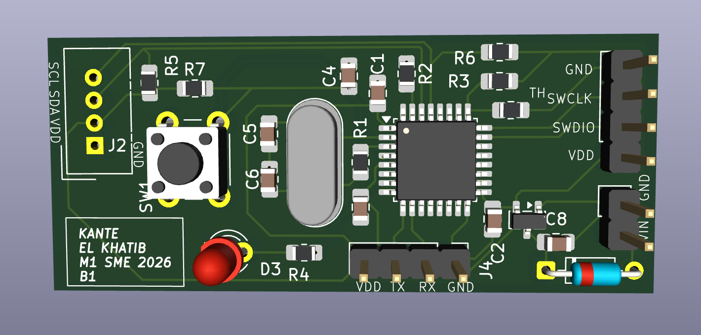
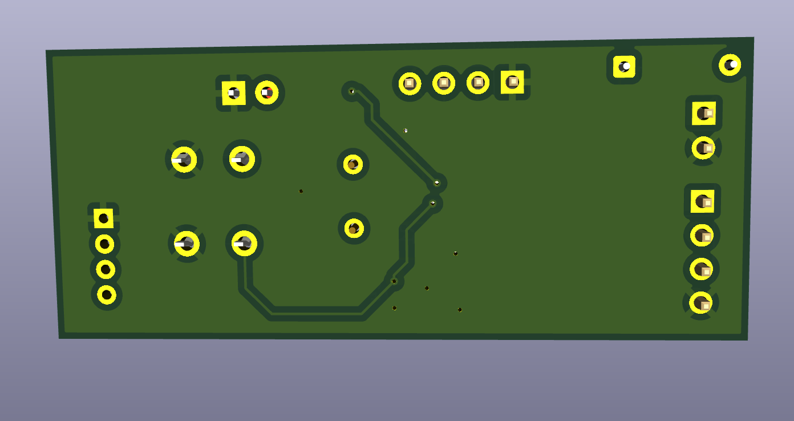
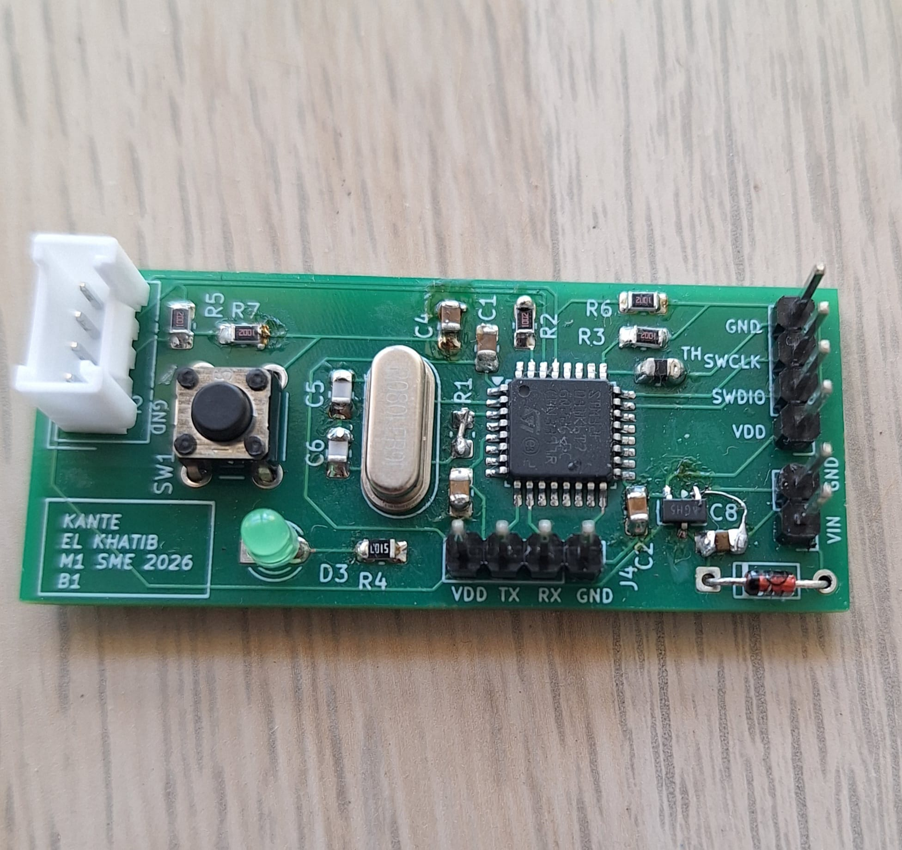

# Conception PCB – STM32F031K6T7 Système Embarqué

 

Carte PCB personnalisée conçue pour un nœud IoT embarqué basé sur le microcontrôleur **STM32F031K6T7**. Réalisée avec **KiCad** dans le cadre d'un cours de conception de PCB pour systèmes embarqués.

---

## Vue d'ensemble

| Paramètre | Valeur |
|-----------|--------|
| Microcontrôleur | STM32F031K6T7 |
| Dimensions | 53 × 22,5 mm |
| Alimentation | 12V / 5V |
| Tension régulée | 3,3V (régulateur embarqué) |
| Cristal | 8 MHz |

---

## Connecteurs

| Connecteur | Type | Fonction |
|------------|------|----------|
| J1 | Grove (4 broches) | Capteur – I2C |
| J2 | Header mâle | Communication – UART (FT232) |
| J3 | Header mâle | Programmateur SWD (ST-Link CN4) |
| J4 | Borne à vis | Alimentation (12V / 5V) |

---

## Capteur – SHT31

Capteur de température et d'humidité compatible Grove.

| Paramètre | Valeur |
|-----------|--------|
| Interface | I2C |
| Alimentation | 3,3V |
| Plage de température | -40°C à +125°C |
| Plage d'humidité | 0–100 %HR |

---

## Communication – FT232 (USB-UART)

Le module basé sur le **FT232R** se connecte à **J2** via UART et fournit une interface série USB vers un ordinateur hôte.

| Broche MCU | Signal | Broche J2 |
|------------|--------|-----------|
| PA9 (TX) | → RX | FT232 RX |
| PA10 (RX) | ← TX | FT232 TX |
| — | GND | GND |
| — | VCC (3,3V) | VCC |

---

## Programmation – ST-Link via J3 (SWD)

| Broche J3 | Signal | Description |
|-----------|--------|-------------|
| 1 | VDD_TARGET | 3,3V de la carte |
| 2 | SWCLK | Horloge SWD |
| 3 | GND | Masse |
| 4 | SWDIO | Données SWD |
| 5 | NRST | Réinitialisation |
| 6 | SWO | Réservé |

Outils utilisés : **STM32CubeIDE** + **STM32 ST-Link Utility**

Commande de flashage :
```
-c SWD -p ${project_loc}\Debug\${project_name}.hex -v -Rst
```

---

## Composants embarqués

| Composant | Fonction |
|-----------|----------|
| LED Verte | Sortie numérique (GPIO) |
| RST | Bouton poussoir – Réinitialisation |
| Y1 | Cristal 8 MHz |
| U2 | Régulateur de tension 3,3V |

---

## Structure du dépôt

```
├── README.md
├── kicad/
│   ├── projet.kicad_sch       # Schématique
│   └── projet.kicad_pcb       # Routage PCB
└── media/
    ├── pcb_top.png           # Photo vue dessus
    ├── pcb_bottom.png         # Photo vue dessous
    ├── carte_pcb.jpeg
    └── demo.mp4               # Vidéo de démonstration
```

---

## Outils

- [KiCad](https://www.kicad.org/) – Conception schématique et PCB
- [STM32CubeIDE](https://www.st.com/en/development-tools/stm32cubeide.html) – Développement firmware
- [STM32 ST-Link Utility](https://www.st.com/en/development-tools/stsw-link004.html) – Flashage

---

## Références

- [Fiche technique SHT31](https://raw.githubusercontent.com/SeeedDocument/Grove-TempAndHumi_Sensor-SHT31/master/res/Grove-TempAndHumi_Sensor-SHT31-Datasheets.zip)
- [Fiche technique FT232R – FTDI](https://ftdichip.com/wp-content/uploads/2020/08/DS_FT232R.pdf)
- [Fiche technique STM32F031K6 – ST](https://www.st.com/en/microcontrollers-microprocessors/stm32f031k6.html)
- [Connecteur SWD CN4 Nucleo – ST UM1724](https://www.st.com/resource/en/user_manual/um1724-stm32-nucleo64-boards-mb1136-stmicroelectronics.pdf)

---

## Photos de la carte





---

## Démonstration

https://github.com/bocarknt/Conception_PCB/blob/main/media/demo.mp4
